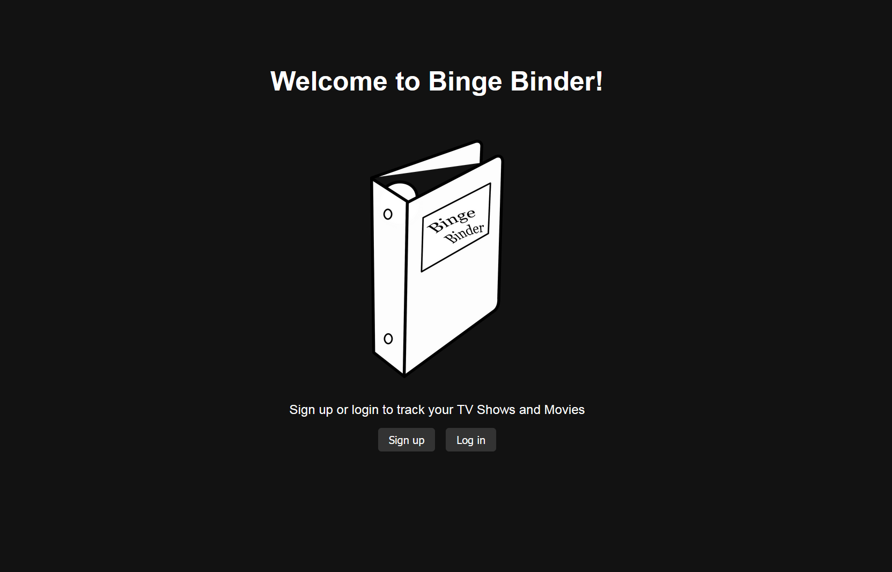
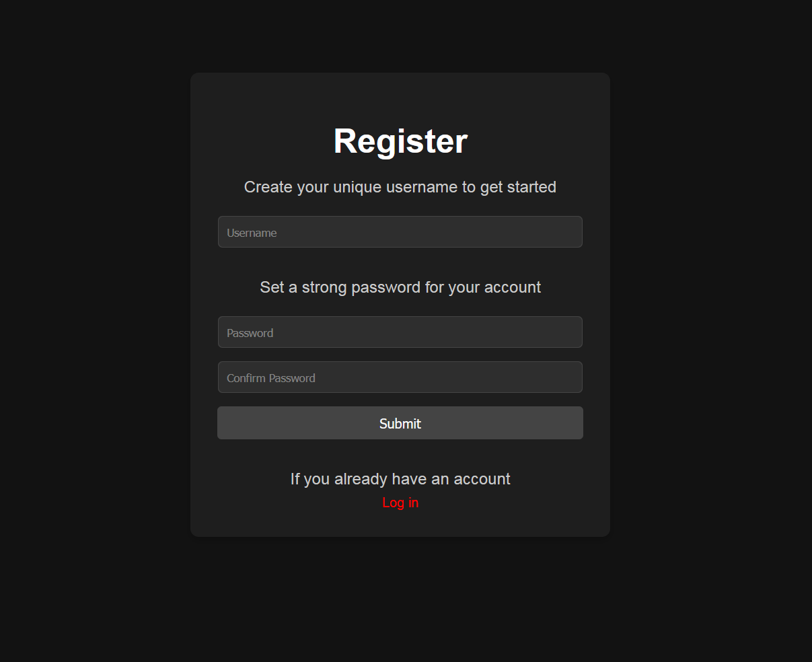
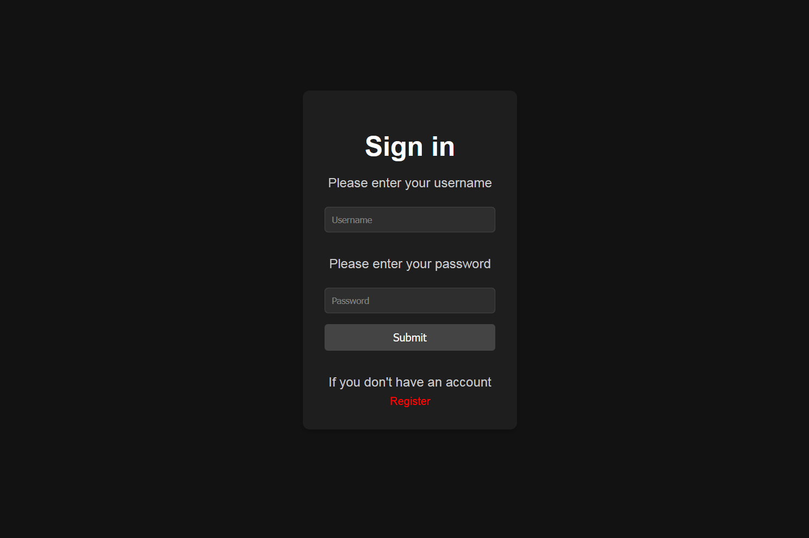
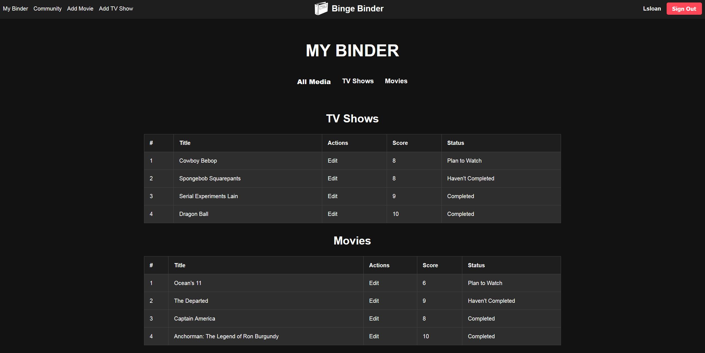
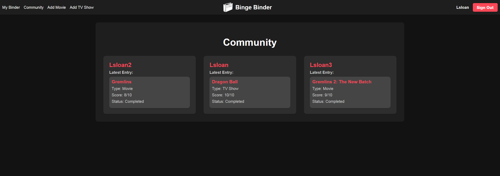
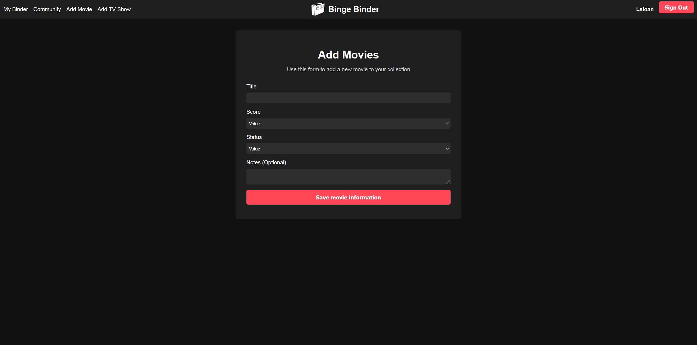
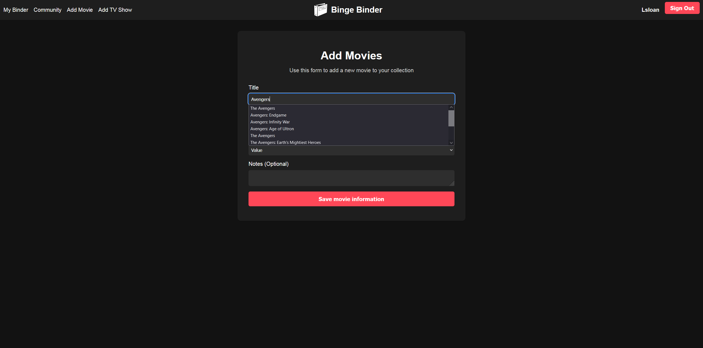
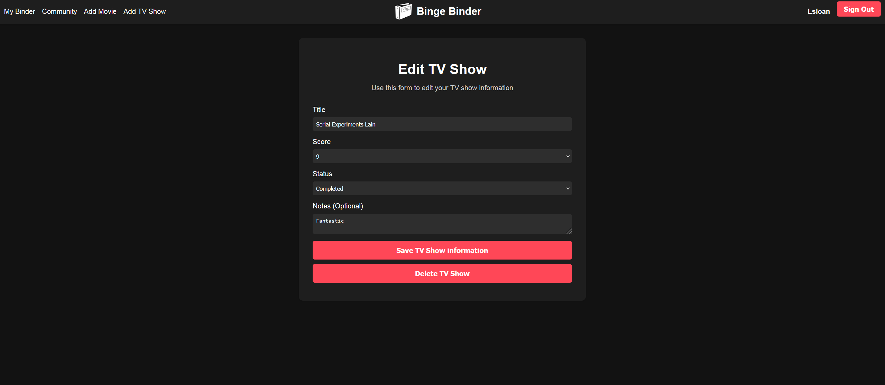
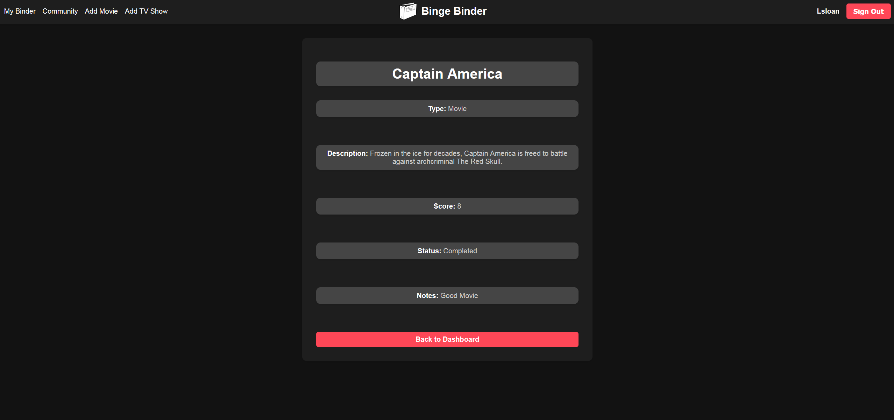

# Binge Binder

  

  # Binge Binder

  ### [Explore Now](https://movie-tv-tracker-app-4cc93bd8d57e.herokuapp.com/)

  ##### Lucas Sloan

  
  

  ## :pencil: Description

 - Binge Binder allows you to track your TV shows and movies in an organized and user-friendly way.
 - Users can add, edit, and review their favorite TV shows and movies.
 - Community feature enables you to see what others are watching and their latest reviews.
 - Integrates with the OMDB API to dynamically fetch titles and descriptions as users add new movies and TV shows.

 ## :mountain: Background

 - The inspiration for Binge Binder came from a desire to organize and keep track of all the TV shows and movies I've watched or plan to watch.
 - This project combines the use of MongoDB, Express.js, and EJS for server-side rendering with a focus on a dark-themed, visually appealing UI.
 - The use of the OMDB API enhances the user experience by providing dynamic suggestions for titles and automatically fetching descriptions for added movies and TV shows.

  ## :camera_flash: Screenshots 

  | Description       | Screenshot                                                |
  |:-----------------:|-----------------------------------------------------------|
  | <h3>Landing Page</h3>  |        |
  | <h3>Sign Up</h3> |  |
  | <h3>Sign In</h3> |  |
  | <h3>Dashboard</h3> |  |
  | <h3>Community</h3> |  |
  | <h3>Add Movies</h3> |  |
  | <h3>Add Tv Shows</h3> |  |
  | <h3>Dynamic Titling</h3> |  |
  | <h3>Edit Page</h3> |  |
  | <h3>Show Page</h3> |  |

## :desktop_computer: Technologies Used

## :satellite: Future Goals

- [ ] Implement single sign-on (SSO) authentication
- [ ] Add a recommendation engine based on user preferences
- [ ] Enable social sharing of reviews
- [ ] Implement a feature to follow other users and get notified of their new reviews

